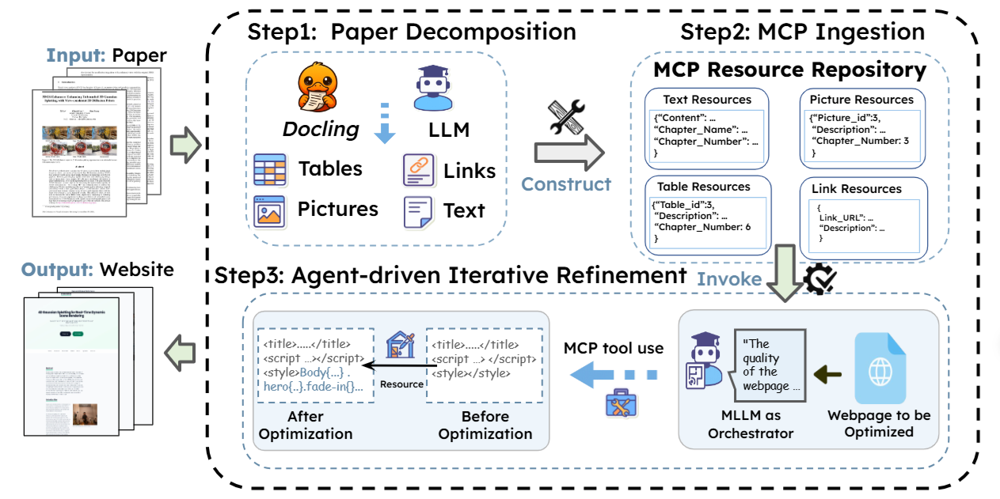

Academic project websites can more effectively disseminate research when they clearly present core content and enable intuitive navigation and interaction. However, current approaches such as direct Large Language Model (LLM) generation, templates, or direct HTML conversion struggle to produce layout-aware, interactive sites, and a comprehensive evaluation suite for this task has been lacking. In this paper, we introduce Paper2Web, a benchmark dataset and multi-dimensional evaluation framework for assessing academic webpage generation. It incorporates rule-based metrics like Connectivity, Completeness and human-verified LLM-as-a-Judge (covering interactivity, aesthetics, and informativeness), and PaperQuiz, which measures paper-level knowledge retention. We further present PWAgent, an autonomous pipeline that converts scientific papers into interactive and multimedia-rich academic homepages. The agent iteratively refines both content and layout through MCP tools that enhance emphasis, balance, and presentation quality. Our experiments show that PWAgent consistently outperforms end-to-end baselines like template-based webpages and arXiv/alphaXiv versions by a large margin while maintaining low cost, achieving the Pareto-front in academic webpage generation. [HERE](https://github.com/YuhangChen1/Paper2All).
