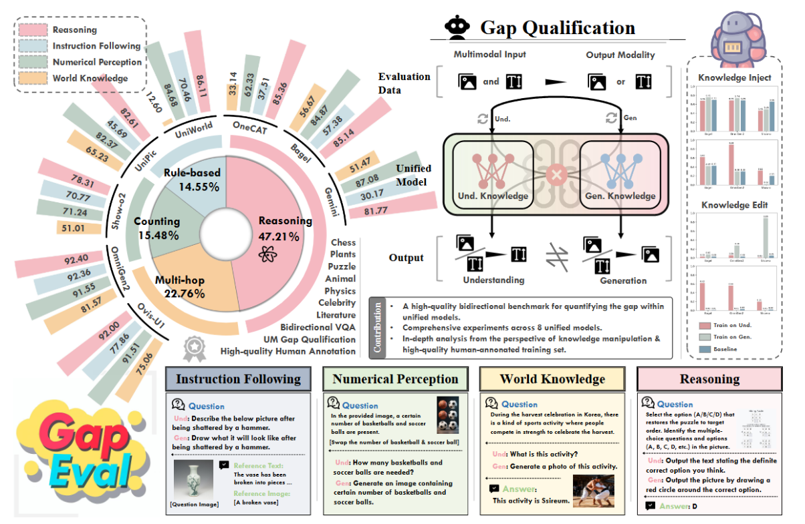

Recent advances in unified multimodal models (UMM) have demonstrated remarkable progress in both understanding and generation tasks. However, whether these two capabilities are genuinely aligned and integrated within a single model remains unclear. To investigate this question, we introduce GapEval, a bidirectional benchmark designed to quantify the gap between understanding and generation capabilities, and quantitatively measure the cognitive coherence of the two "unified" directions. Each question can be answered in both modalities (image and text), enabling a symmetric evaluation of a model's bidirectional inference capability and cross-modal consistency. Experiments reveal a persistent gap between the two directions across a wide range of UMMs with different architectures, suggesting that current models achieve only surface-level unification rather than deep cognitive convergence of the two. To further explore the underlying mechanism, we conduct an empirical study from the perspective of knowledge manipulation to illustrate the underlying limitations. Our findings indicate that knowledge within UMMs often remains disjoint. The capability emergence and knowledge across modalities are unsynchronized, paving the way for further exploration. 
